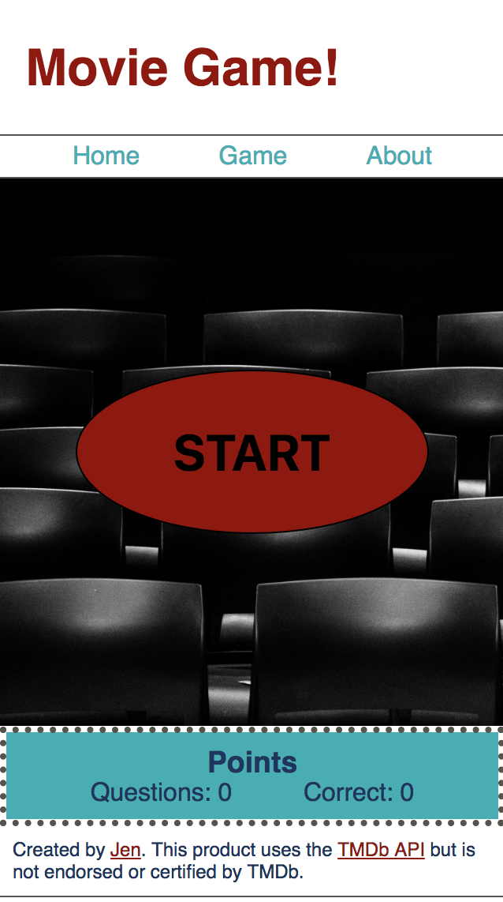
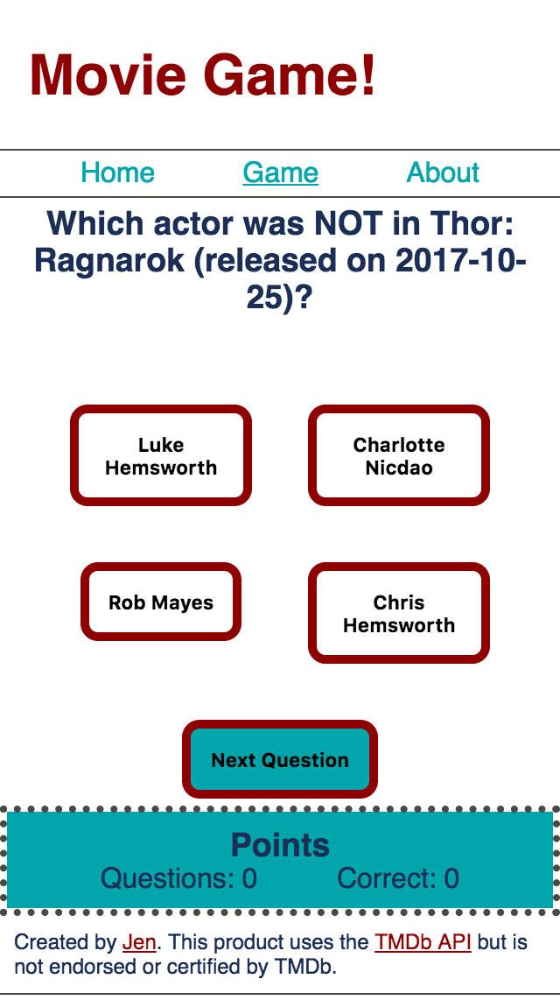
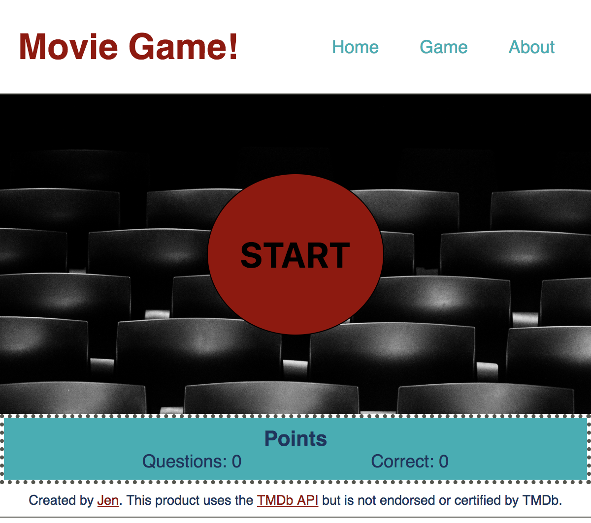
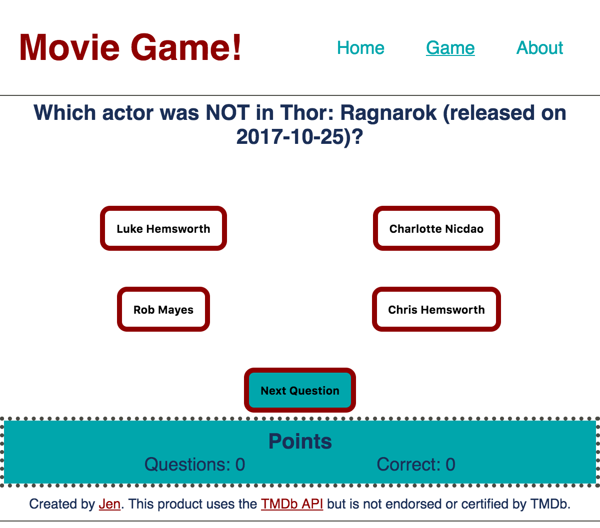
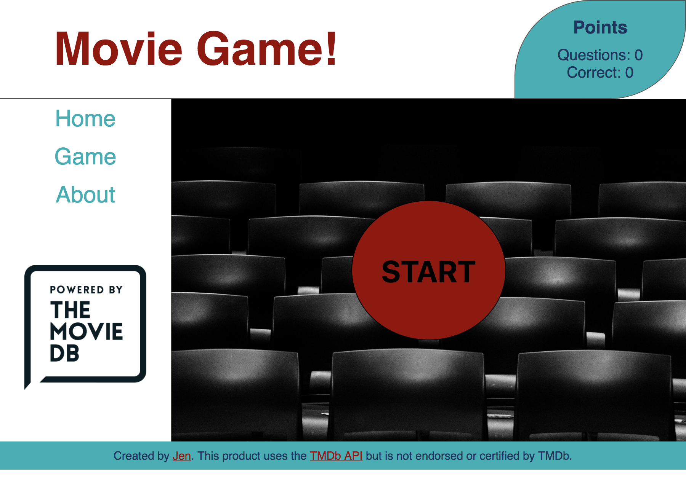
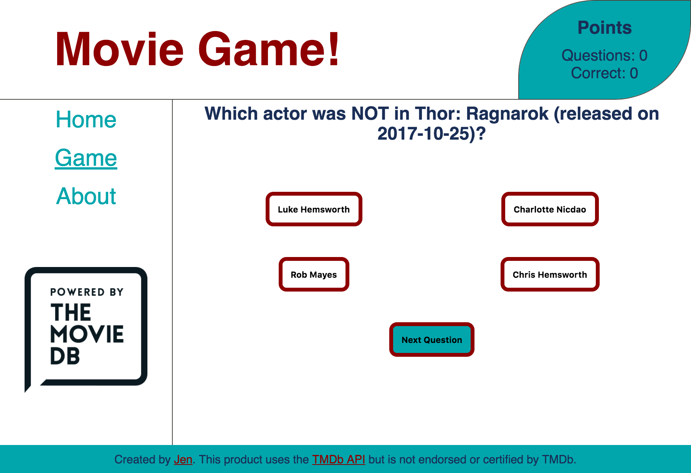

Movie Game!
===========
By Jennifer Evenson

Demo
====
https://movie-game.netlify.com/

Objective
=========
Create a game using data pulled from The Movie Database API. Users are shown a movie title and the names of 4 actors. They have to guess which actor was NOT in the movie.

Functionality
=============
Mobile first design. Laid out with CSS Grid so that I could practice easily moving sections around the page at different media breaks. Small layout in effect up to 600px wide, medium layout from 600 - 899px, and large layout from 900px.

The user-facing functionality is pretty straightforward, so here's what is happening behind the scenes:

*   When the app loads, it grabs - from The Movie Database API - a list of the 20 most popular movies out of the combined pool of movies in the action, comedy, and family genres and saves them in an array in the "Redux store".
*   It grabs the 120 most popular non-adult actors from the API and saves them in the Redux store as a "pool of potential answers".
*   Questions are built on the fly, when the user clicks "start" or "next question".
    *   A random movie is chosen from the app's Redux store.
    *   An axios "get" request is made to the API to get the cast list for that movie.
    *   Three cast members are chosen and saved to an "answers" array.
    *   One actor is chosen from the "pool of potential answers" and verified to NOT be in that movie. That name is then added to the "answers" array as the final answer choice for that question.
    *   The "answers" array is then shuffled so the correct answer (the one added to the array last) is not always in the same spot on the screen.
    *   The game component maps through the answer array to display the choices on the screen.
    *   When the user clicks an answer, the app turns the correct answer green. The "questions" counter in the Points section is incremented. And if the user got the answer right, the "correct" counter in the Points section is incremented.

Technologies Used
=================
* Front End: HTML5, CSS3, JavaScript, React, React Router, Redux + Thunk, Axios
* API used: [The Movie Database<](https://www.themoviedb.org/)
* Hosted at Netlify

Challenges / Lessons Learned
============================
* If you're going to build a trivia game, use a question API or build one. Don't just pull facts from an API and build questions on the fly when the user clicks on "next question". 
* This was our first project using React / Redux / Thunk, so lots of practice with those, and with lifecycle methods.
* Learned how to do a second axios.get based on information obtained from the first request. (And have since learned a "better" way to do it, which will be implemented in a future update.)
* How to work around limitations / design of the API.
* How to structure methods in my components such that I could do my simple MVP / proof of concept and then re-use them with minimal effort for the more complicated thing.
* Lots of practice getting random elements from an array.

Mobile Views
============

| Home Page | Question Page |
| :---: | :---: |
|  |  |

Medium Size
===========
## Home page

## Question Page

Desktop Views
=============
## Home page

## Question Page

Ideas for Improvements
======================
* Add user authentication, so players could save their score / progress and the site can display "high scores".
* Add the ability to have "player 1" and "player 2" so friends could play against each other.
* Make it more obvious that after an answer is clicked, the one that turns green is the right answer. 
* Make the answer choice buttons all the same size at every screen width.
* Hide the "next question" button until the user has answered the question.
* Display only the release year, not the entire date.
* Increase the size of the pool of movies from which to quiz.
* Get help from an artistic classmate so it doesn't look like it was designed by a 5-year-old wearing a blindfold. 

Inspiration for the Project
===========================
This was an [assignment](assignment.md) for a class. 
